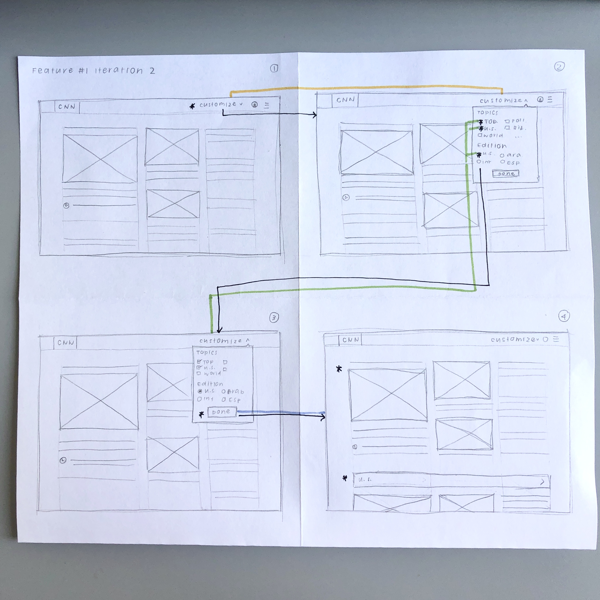

# Assignment #05: Low Fidelity Prototype
Kelly Zhong, DH 110
  

## Project Overview
**Project Description:**  
The goal of my project is to redesign the CNN.com website to help users more easily consume news. Specifically, like many news websites, CNN.com is hard to navigate because of the overwhelming amount of content and the lack of clear organization and layout design of that content. With my project, I hope to add features that will improve the website's organization and help users to find desired content.
 

**Purpose:**  
The purpose of creating this low-fidelity prototype is to ensure that the suggested features (1) address the user pain point of unorganized and overwhelming content, (2) help users to more easily find the content that they are interested in, and (3) fit naturally within the existing design system. 
 

**Tasks:**  
The two features that my low-fidelity prototypes demonstrate are: 
  
1. **Customize feed feature**: a filter function that gives users the ability to personalize their homefeed to see only the content that they want to see.
2. **Accessible newsfeed feature**: a function that gives users the ability to turn on "accessibility mode", which rearranges the newsfeed to make it easier to read and understand.

Based on these two features, the low-fidelity prototype will support the following tasks: 
1. Select customize feed function 
2. Choose desired topics 
3. Apply personalized changes 
4. Turn on accessibility mode 
 

## Wireframes and Wireflows
### Basic wireframes
**Feature 1:**  

  
**Feature 2:**  

  

### Testing
**Wireflows:**  

 

**Iteration 1:**  

 
_Problem:_ For **Feature 1**, the user was told to customize the newsfeed so that the feed only showed top news and news about the United States. While the user was going through the process, everything went smoothly until she was done choosing the desired topics. She was confused about whether the feed would automatically update if she waited long enough, or if she had to press outside the "Customize" box to apply the changes. For **Feature 2**, the user was told to navigate to the Settings to turn on Accessibility Mode. However, after pressing the profile button, she was confused why the screen automatically went to the Settings. Furthermore, she felt as if it would have been more intuitive for the "Site Display" section to be above the "Basic Info" section, since the sections after are also about personal user information. 
  
_Changes made:_ For **Feature 1**, I added a button that says "Done" underneath the personalization options. After pressing this button, the newsfeed would refresh with changes applied. For **Feature 2**, I added another screen that included the drop-down that appears after cliking the profile icon. This drop-down has the options "Settings" and "Log out". Additionally, I rearranged the sections in the Settings, putting the "Site Display" section above the "Basic Info" section.
 

**Iteration 2:**  

 
Problem: Everything went smoothly in this round of user testing; however, the user brought up suggestions regarding the copy of the text. Specifically, she wondered if instead of "Customize" for feature 1, the word "Personalize" or "Display" would work just as well or better. She also brought up concerns about Accessibility Mode being the only element under the "Site Display" section for feature 2.
 
Changes to be made: If I was to create another iteration, I would play around with different wordings for feature 1. I would test if the words "Personalize" or "Display" were more intuitive for the user by conducting more user testings. Furthermore, I would consider placing Accessibility Mode on the homepage to make it easier for users to find. 
  

## Reflection
+1: Summary of the process, what went smoothly or differently from your expectation
+1: What you would change or design differently based on the feedback you got from the prototype testing. 
