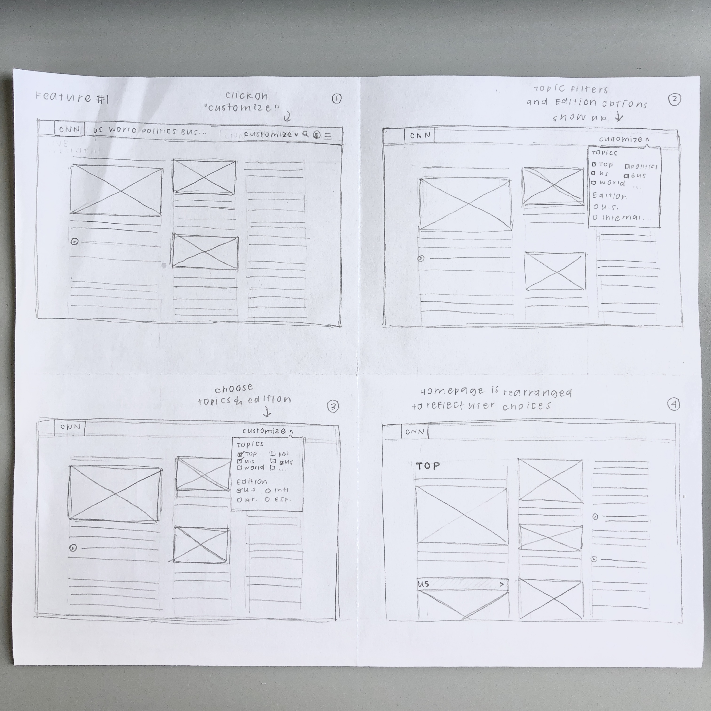
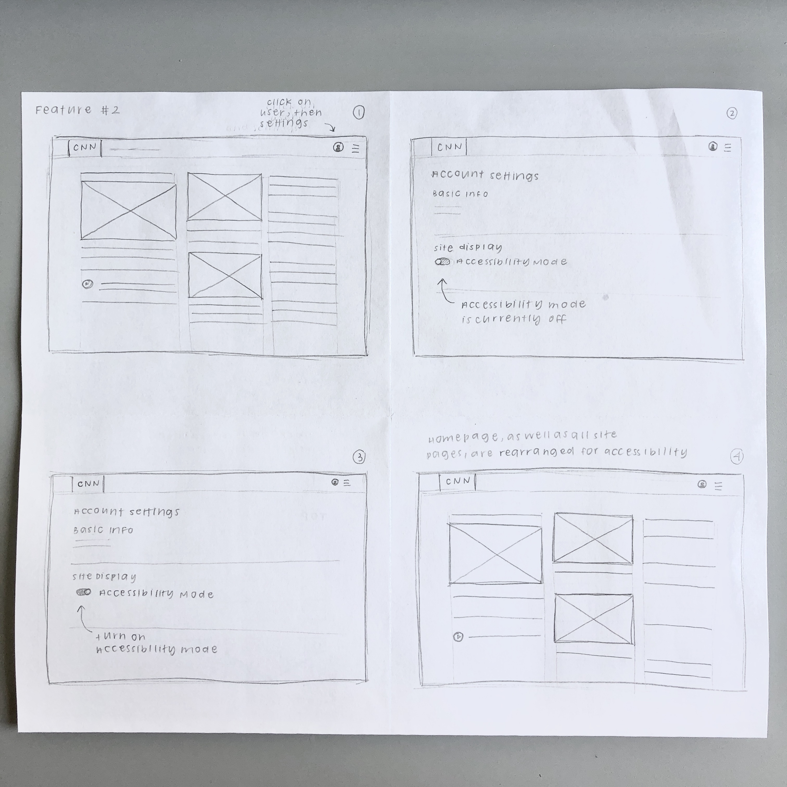
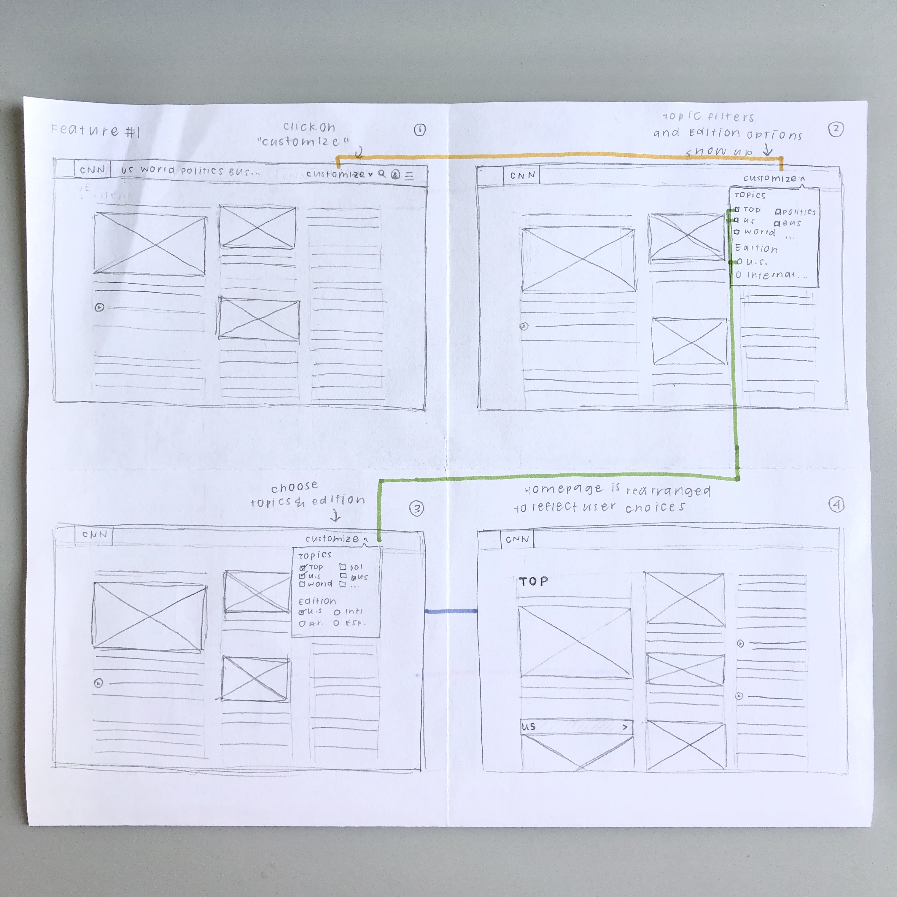
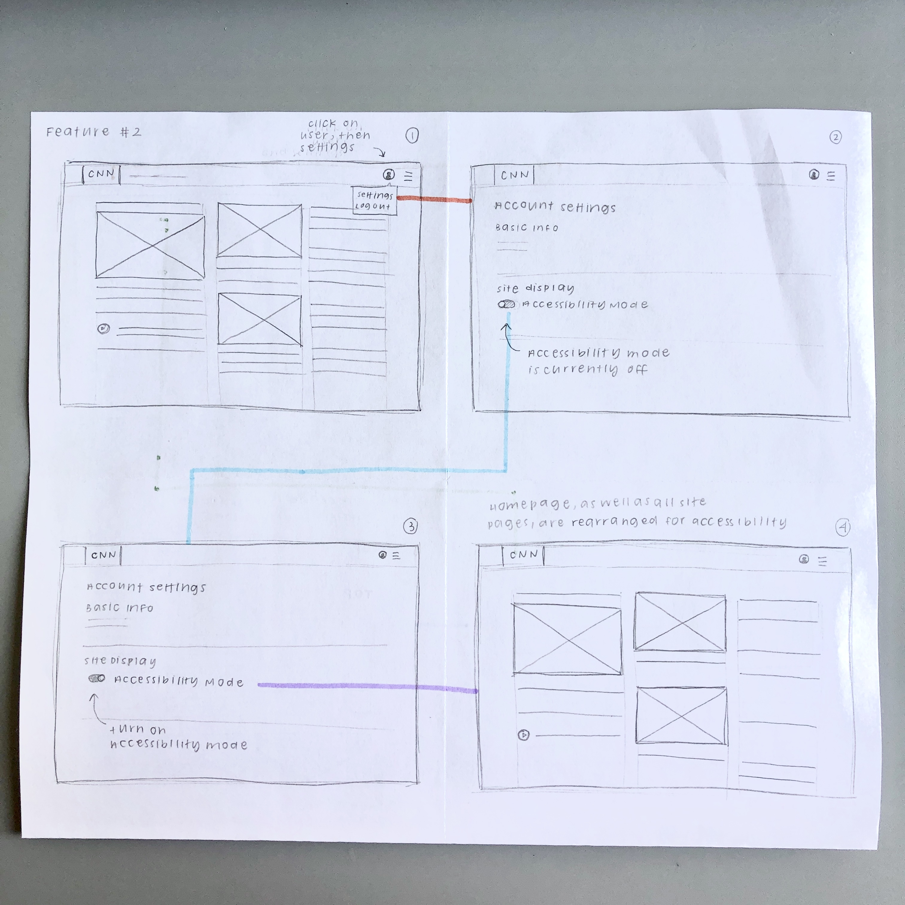
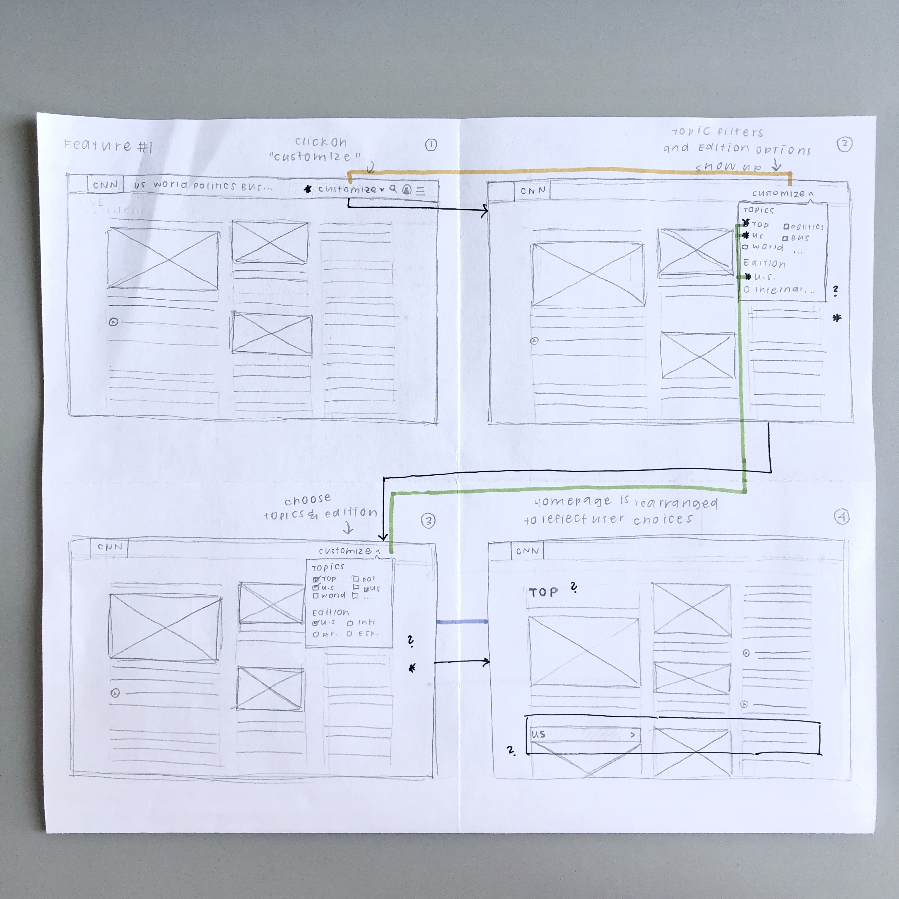
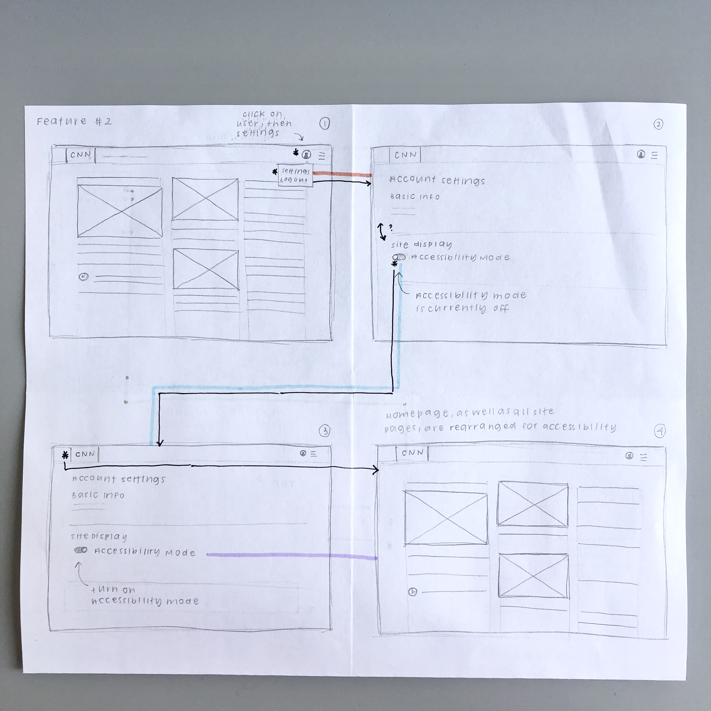

# Assignment #05: Low Fidelity Prototype
Kelly Zhong, DH 110
  

## Project Overview
**Project Description:**  
The goal of my project is to redesign the CNN.com website to help users more easily consume news. Specifically, like many news websites, CNN.com is hard to navigate because of the overwhelming amount of content and the lack of clear organization and layout design of that content. With my project, I hope to add features that will improve the website's organization and help users to find desired content.
 

**Purpose:**  
The purpose of creating this low-fidelity prototype is to ensure that the suggested features (1) address the user pain point of unorganized and overwhelming content, (2) help users to more easily find the content that they are interested in, and (3) fit naturally within the existing design system. 
 

**Tasks:**  
The two features that my low-fidelity prototypes demonstrate are: 
  
1. **Customize feed feature**: a filter function that gives users the ability to personalize their homefeed to see only the content that they want to see.
2. **Accessible newsfeed feature**: a function that gives users the ability to turn on "accessibility mode", which rearranges the newsfeed to make it easier to read and understand.

Based on these two features, the low-fidelity prototype will support the following tasks: 
1. Select customize feed function 
2. Choose desired topics 
3. Apply personalized changes 
4. Turn on accessibility 
 

## Wireframes and Wireflows
### Basic wireframes
**Feature 1:**  

  
**Feature 2:**  

  

### Testing
**Wireflows:**  

 

**Iteration 1:**  

 
Problem: 
 
Changes made:
 

**Iteration 2:**

Problem: 
Changes made:
  

## Reflection
+1: Summary of the process, what went smoothly or differently from your expectation
+1: What you would change or design differently based on the feedback you got from the prototype testing. 
